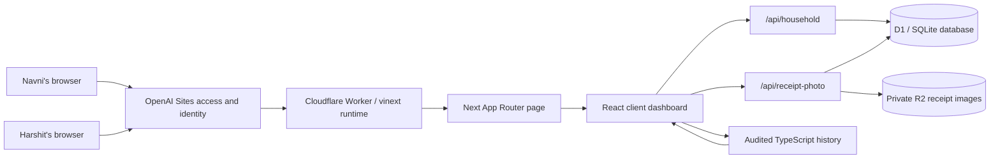
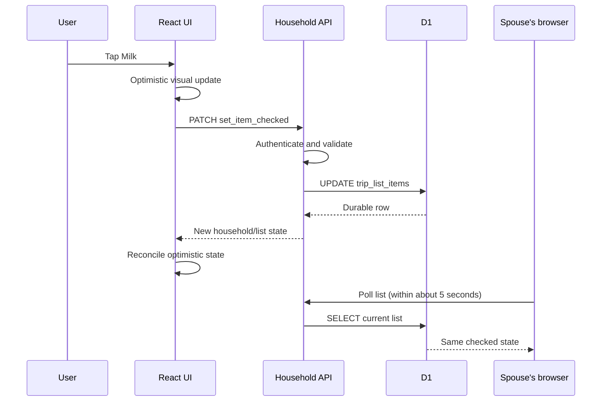
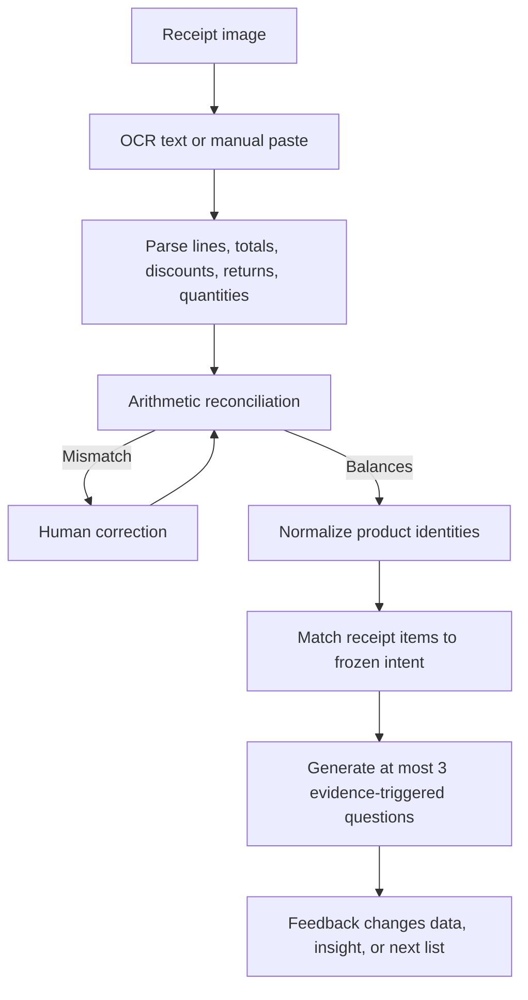
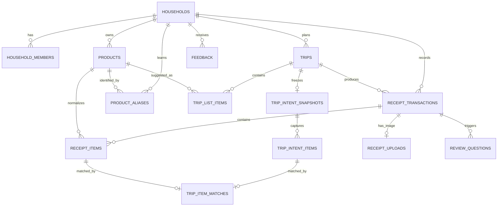

# BasketSense full-stack learning guide

This guide explains the application you now own: what happens from the moment a spouse taps a list item to the moment both phones show the same state, how a receipt becomes structured evidence, and how to inspect the database without accidentally changing it.

It is written as a learning path, not merely a code reference. Read Chapters 1–4 first, then use the database lab in Chapter 10 while the local app is running. The later chapters explain schema changes, testing, deployment, and the next architectural steps.

## 1. The application in one paragraph

BasketSense is a private, two-person Costco companion. Its core loop is:

1. Use purchase history and explicit rules to propose a Saturday list.
2. Let both spouses edit one shared list.
3. Capture a pre-trip snapshot of intent when shopping starts.
4. Upload and review the actual receipt.
5. Deterministically compare planned items with purchased items.
6. Ask only evidence-triggered questions whose answers improve the data or the next list.

This is deliberately not a generic budgeting app. The most important data product is the closed loop between **intent**, **purchase**, and **household outcome**.

## 2. The most important truth about the current implementation

BasketSense has a deliberate initial-render fallback and a canonical shared-data path. Understanding the distinction prevents a common full-stack mistake: assuming that every value visible in a database-backed application came from the database.

| Surface | Current source | Is it live/shared? |
| --- | --- | --- |
| Saturday list, checks, freeze state, receipt drafts, review answers | D1 database through `/api/household` | Yes |
| Receipt image files | Private R2 object storage through `/api/receipt-photo` | Yes |
| Product names/categories edited by the household | D1, merged into the dashboard view | Yes |
| Initial server-rendered dashboard shell | Audited TypeScript history in `app/basketsense-data.ts` | Brief fallback while the authenticated household state loads |
| Historical spending charts, transaction drill-downs, and product history after hydration | Reconciled D1 receipt and product rows through `/api/household` | Yes; a finalized reconciled receipt updates these views |
| Suggested July 25 list | Purchase histories plus a curated policy set | Deterministic, but not yet a generic prediction engine |

The API seeds the audited historical data into D1 and builds the hydrated dashboard view directly from reconciled D1 transactions, receipt lines, and product metadata. The original audited TypeScript dataset remains an intentionally independent parity reference. An automated integration test constructs both dashboard objects and requires an exact match for the audited January–July history before the D1 view reaches the client.

The server-rendered fallback keeps the first paint stable while browser authentication and shared-state loading occur. It is visually equivalent to the D1 view because of the parity test; the hydrated, interactive dashboard is the canonical D1-backed view.

## 3. High-level architecture



### The layers

| Layer | Responsibility | Main files |
| --- | --- | --- |
| Hosting and identity | Runs the site, restricts access, injects the authenticated user's headers | `.openai/hosting.json`, `app/chatgpt-auth.ts` |
| Worker runtime | Receives requests and supplies Cloudflare bindings such as D1 and R2 | `worker/index.ts`, `vite.config.ts` |
| Server-rendered entry | Verifies identity and prepares initial view data | `app/page.tsx` |
| Client UI | Renders tabs, holds temporary UI state, calls APIs, polls for spouse changes | `app/basket-sense-dashboard.tsx`, `app/receipt-review-flow.tsx` |
| API routes | Authenticate, validate commands, enforce domain rules, read/write storage | `app/api/household/route.ts`, `app/api/receipt-photo/route.ts` |
| Domain logic | Recommendations, receipt parsing, matching, reconciliation, display derivations | `app/recommendation-engine.ts`, `app/receipt-logic.ts`, `app/basketsense-dashboard-data.ts` |
| Relational data | Shared list, trips, receipts, products, intent snapshots, matches, feedback | `db/schema.ts`, `drizzle/` |
| Object storage | Original private receipt image bytes | R2 binding named `RECEIPTS` |

### Why this is “full stack”

A full-stack feature crosses several boundaries. “Check milk off the list” is not just a checkbox:



You have touched the frontend, HTTP, authentication, backend, SQL, database consistency, and cross-device synchronization in one small interaction.

## 4. Repository tour

Start with these files in this order:

1. [`app/page.tsx`](../app/page.tsx) — the server-rendered entry point.
2. [`app/basket-sense-dashboard.tsx`](../app/basket-sense-dashboard.tsx) — client orchestration, API calls, polling, tab routing, and the main tab components. `ThisWeekTab` is the most important workflow inside this file.
3. [`app/receipt-review-flow.tsx`](../app/receipt-review-flow.tsx) — image/OCR review and receipt-correction UI.
4. [`app/api/household/route.ts`](../app/api/household/route.ts) — the application service and transactional rules.
5. [`db/schema.ts`](../db/schema.ts) — the durable data model.
6. [`app/dashboard-product-metadata.ts`](../app/dashboard-product-metadata.ts) — merges reviewed live product metadata into dashboard products.
7. [`app/receipt-logic.ts`](../app/receipt-logic.ts) — parsing, arithmetic, and deterministic matching.
8. [`app/recommendation-engine.ts`](../app/recommendation-engine.ts) — suggested-list rules.
9. [`app/basketsense-data.ts`](../app/basketsense-data.ts) — audited historical input still used by the dashboard.
10. [`app/basketsense-dashboard-data.ts`](../app/basketsense-dashboard-data.ts) — derives display-ready historical data.

Other important directories:

- `drizzle/`: generated SQL migrations and migration metadata.
- `tests/`: unit and integration-style tests for domain rules and important UI contracts.
- `public/`: static assets served with the site.
- `.wrangler/`: ignored local Cloudflare/Miniflare state, including your local D1 file.
- `dist/`: generated production build output; do not edit it directly.
- `Costco Receipts/`: source evidence used during the audit; not application code.

## 5. How the frontend works

### Server component versus client component

`app/page.tsx` runs on the server. It can read request identity headers and redirect an unauthenticated visitor before protected data is rendered. It then builds the initial audited dashboard view and passes serializable data into `BasketSenseDashboard`.

`BasketSenseDashboard` runs in the browser because it needs taps, dialogs, optimistic state, timers, focus events, and network requests. In Next terminology it is a client component.

A useful mental model:

- The server component answers: **who may see this page and what should the first render contain?**
- The client component answers: **what happens after the person starts interacting?**
- The API answers: **which state changes are valid and durable?**

### State has three different lifetimes

Do not treat all React state as “the data.” It belongs to one of three lifetimes:

| Lifetime | Example | Where it should live |
| --- | --- | --- |
| Ephemeral UI state | Which dialog is open, selected tab | React state only |
| Optimistic state | A checkmark shown while its request is in flight | React state, then reconciled with server state |
| Durable household state | The included list, frozen intent, receipt corrections | D1 through the API |

If a phone refresh must preserve it, or the other spouse must see it, it generally belongs in the durable layer.

### Shared-list synchronization

The current synchronization strategy is intentionally simple:

- Save every meaningful list mutation to the API.
- Refresh the list about every five seconds while the Week tab is visible.
- Refresh less frequently on other tabs.
- Refresh on browser focus, visibility restoration, and network reconnection.
- Avoid polling over a write that is still in progress.

This is polling, not WebSockets. For two users, polling is easier to reason about, inexpensive, and reliable enough. Real-time subscriptions would add connection lifecycle, reconnection, ordering, and duplicate-event complexity without materially improving the household test.

### Optimistic writes

The UI changes immediately, then calls the server. If the server rejects the operation, it refreshes from the canonical state and shows the error. This makes the app feel fast while keeping D1 authoritative.

The design rule is: an optimistic change must be reversible. Never permanently remove the previous value until the server confirms it or a refresh can restore it.

### Dark mode and responsive design

Theme selection is a client preference and can remain local to a browser. Shared list content cannot. This is a helpful contrast: not every preference needs a database table.

Most layout and theme rules live in [`app/globals.css`](../app/globals.css). When modifying a visual component, check at least:

- narrow mobile viewport;
- desktop width;
- light theme;
- dark theme;
- keyboard focus;
- text and icon contrast;
- loading, empty, and error states.

## 6. How the backend works

### There are two API surfaces

#### `/api/household`

This is a command-and-query endpoint for household state.

- `GET /api/household` returns the full current household view.
- `GET /api/household?scope=list&tripId=...` returns a smaller payload for frequent list polling.
- `POST /api/household` creates records or initiates multi-step operations.
- `PATCH /api/household` modifies existing state or changes lifecycle status.

The body contains an `action` discriminator. The API validates that action and dispatches to one domain operation.

| Method/action | What it does |
| --- | --- |
| POST `add_list_item` | Adds a manual/catalog item and its best available estimate |
| PATCH `set_item_included` | Moves an item into or out of the active list |
| PATCH `set_item_checked` | Changes its in-store completion state |
| PATCH `freeze_trip` | Captures intent and begins shopping |
| PATCH `unfreeze_trip` | Returns to planning and removes the mistaken snapshot |
| POST `ingest_receipt_draft` | Creates a reviewable receipt and parsed lines |
| PATCH `update_receipt_draft` | Saves human corrections and rebuilds derived receipt state |
| PATCH `finalize_receipt` | Accepts a reconciled receipt and generates comparisons/questions |
| POST `answer_review_question` | Stores the answer and applies its declared effect |
| POST `add_feedback` | Records an explicit household outcome signal |
| PATCH `confirm_product_metadata` | Reviews a product name or category |

#### `/api/receipt-photo`

This route keeps large binary data out of the relational database.

- `POST` accepts one authenticated image upload, validates its MIME type and 12 MB size limit, writes it to private R2 storage, and records metadata in D1.
- `GET` checks household authorization, reads the metadata from D1, streams the R2 object, and sends private/no-store response headers.

D1 stores searchable facts *about* a file. R2 stores the file bytes. That separation is a common production architecture pattern.

### Authentication versus authorization

These are related but not identical:

- **Authentication** proves which signed-in person made the request. The hosted environment injects `oai-authenticated-user-email` and an optional encoded full name.
- **Authorization** decides whether that person may act on this household or receipt.

The site access policy is the outer gate. The API then connects authenticated emails to `household_members`. The bootstrap logic stops automatic household enrollment after two members.

Learning caveat: “first two authenticated visitors become members” is convenient for the private MVP but is weaker than an explicit email allowlist inside the application. If this ever becomes public or multi-household, replace bootstrap enrollment with invitations or a server-side allowlist.

### Validation belongs on the server

Even if the UI hides an invalid button, a caller can still send an HTTP request manually. Rules such as “only freeze a planning trip,” “only read receipts from your household,” and “a finalized receipt must reconcile” must be enforced in the API.

Frontend checks improve usability. Backend checks protect truth.

### Transactions and atomicity

Freezing a trip changes several rows: trip status, freeze totals, an intent snapshot, and its snapshot items. Those writes represent one logical event. The API batches them so callers do not see a half-frozen trip.

Ask this for every multi-row operation: **if the process stops after the third statement, would the database describe an impossible state?** If yes, it needs a transaction/batch or an idempotent recovery strategy.

### Idempotency

Historical seed writes use stable IDs and upserts so repeated bootstrapping does not duplicate receipts. Receipt source keys are unique per household. These are examples of idempotency: running the same logical command again produces the same final state.

Idempotency matters when phones retry requests, networks fail after a server commit, or deployments restart.

## 7. The recommendation engine

The recommendation engine starts with explainable statistics, not an LLM.

For each product history it can use:

- number of prior purchases;
- median days between purchases;
- days since the last purchase;
- units normally purchased;
- recent consecutive-week patterns;
- last observed paid price;
- explicit household policy such as essential, check first, or seasonal.

Conceptually:

```text
due_ratio = days_since_last_purchase / typical_interval

confidence rises when:
  purchase history is repeated
  intervals are consistent
  the item is currently due
  an explicit essential policy supports it

confidence falls when:
  history is sparse
  intervals vary widely
  a recent exceptional purchase distorts cadence
  the item needs a pantry/freezer check
```

The output must include a human-readable explanation, such as:

> Milk — 88% confidence; usually purchased every 7–9 days; last purchased 8 days ago.

### Current limitation

The July 25 generator still uses a curated policy list to decide which product histories are eligible and which section they enter. It is deterministic and explainable, but it is not yet a generic engine that scores every catalog product.

A good next evolution is:

1. compute cadence features for every product with enough history;
2. assign a confidence based on consistency and due ratio;
3. apply household overrides for essentials, seasonal items, and exclusions;
4. present borderline products under “Check first” rather than auto-adding them;
5. measure acceptance and rejection before tuning weights.

Do not add an LLM until deterministic errors are understood. An LLM may later help interpret novel descriptions or summarize evidence, but it should not invent purchase facts or reconcile arithmetic.

## 8. The receipt pipeline

Receipt understanding is not one AI call. It is a staged pipeline in which every stage preserves evidence and makes uncertainty visible.



### Stage 1: image storage

The original image is stored privately in R2. D1 records its storage key, filename, content type, byte size, receipt relationship, and uploader.

### Stage 2: OCR

The review UI can attempt client-side OCR through an optional Tesseract module and allows pasted/manual text as a fallback. OCR output is a draft, never truth.

Current caveat: Tesseract is dynamically optional rather than a normal installed dependency. The fallback path matters, and a production-grade OCR service has not been selected.

### Stage 3: parsing

`parseCostcoOcrText` looks for:

- a trailing line amount;
- receipt summary labels;
- item numbers;
- quantity formats;
- discounts and returns;
- tax suffixes;
- unreadable or ambiguous lines.

It does not invent an amount when the source is unreadable.

### Stage 4: reconciliation

Reconciliation tests whether header totals, item lines, discounts, tax, external funding, and returns agree under one sign convention. A receipt stays `needs_review` until the arithmetic is trustworthy.

This separates two questions:

1. **Did we read the receipt correctly?** Data quality.
2. **What did the purchase mean to the household?** Intent and outcome.

### Stage 5: product normalization

The raw receipt description remains intact. A canonical `products` row says that `KS ORG 2% MK` means “Kirkland Organic 2% Milk.” `product_aliases` can remember confirmed mappings without rewriting the original evidence.

### Stage 6: intent matching

The matcher scores every plausible pair between frozen intent items and purchased receipt lines, sorts candidate pairs by score, and accepts only strong one-to-one matches. Item number and canonical product identity outrank fuzzy name similarity. Discount-only lines are not treated as products.

The result can support these evidence-backed classes:

- planned and purchased;
- planned but not found;
- receipt-only purchase;
- possible substitution;
- unresolved receipt line.

“Receipt-only” means it was absent from the snapshot. It does **not** mean impulsive, wasteful, or regretted.

### Stage 7: review questions

The system generates at most three questions, prioritized approximately as:

1. a material unresolved receipt line;
2. a missing essential or possible substitution;
3. the largest receipt-only addition.

Every question declares what its answer will change. If an answer does not correct the receipt, clarify intent, improve an insight, or influence the next list, the question should not be asked.

## 9. Database design in depth

### What D1 actually is

Cloudflare D1 is a managed relational database whose SQL model is based on SQLite. Locally, the Cloudflare development runtime uses an ordinary SQLite database file inside `.wrangler/`. In production, the Worker receives a D1 binding named `DB` and queries it through Cloudflare's runtime API.

Drizzle is a separate layer:

- `db/schema.ts` expresses tables and indexes in TypeScript.
- `drizzle-kit` generates SQL migration files.
- The main household API currently issues explicit D1 SQL using `prepare(...).bind(...)` rather than using Drizzle's query builder for most reads/writes.

That means Drizzle currently provides schema types and migrations more than it provides the runtime data-access abstraction.

### Why relational tables fit this product

BasketSense has strong relationships:

- a household has two members;
- a trip has many list items;
- a frozen snapshot has many immutable intent items;
- a receipt has many receipt items;
- a receipt item may match one intent item;
- feedback may refer to a particular trip or item.

A relational database lets foreign keys and unique indexes encode many of these truths. A single unstructured JSON document would be easier on day one but harder to query, reconcile, and update safely from two devices.

### Entity relationship diagram



### The 14 application tables

#### 1. `households`

The root tenant. It holds the household name, slug, and time zone. Nearly every durable record is directly or indirectly scoped to a household.

#### 2. `household_members`

Maps authenticated emails to the household and gives changes attribution. `role` is currently `owner` or `member`. The unique household/email index prevents duplicate membership rows.

#### 3. `products`

The canonical product catalog. It separates a stable household concept such as “Huggies Pull-Ups 4T–5T” from raw descriptions on individual receipts. It also stores category review status, Costco item number, brand, unit description, and whether the product is active.

#### 4. `trips`

One planning cycle, normally a Saturday. It stores lifecycle state (`planning`, `frozen`, `completed`), optional spending target/discovery allowance, and the list estimate captured at freeze.

A trip is not a financial transaction. One trip may produce warehouse and fuel receipts.

#### 5. `trip_list_items`

The mutable live list. It stores the label, section, recommendation source/reason/confidence, included/check state, quantity, current estimated price, and attribution.

Removing an item from the active list changes `included`; the recommendation catalog can still offer it again. Checking an item changes `checked` and does not remove the underlying row.

#### 6. `receipt_transactions`

One financial event: warehouse, fuel, optical, or return. It stores source identity, purchase time, item gross, item count, subtotal, tax, discount, total, household versus external funding, audit flag, and reconciliation status.

This is why optical can show gross receipt value without falsely claiming the household paid the insurance-funded portion.

#### 7. `receipt_items`

Individual receipt lines. These preserve raw descriptions and source line numbers while optionally linking to canonical products. Quantities, unit price, subtotal, discount, net amount, tax status, return status, and match confidence remain separately queryable.

#### 8. `feedback`

Explicit household signals such as trip enjoyment, discovery outcome, duplicate, waste, regret, receipt correction, fulfillment reason, or product experience. It can point to the exact trip, receipt, list item, or receipt item involved.

#### 9. `trip_intent_snapshots`

The immutable header captured when shopping starts: evidence level, estimated total, priced/unpriced counts, author, and capture time. It exists so later list edits cannot rewrite history.

#### 10. `trip_intent_items`

The item-level contents of that snapshot. This table is separate from the mutable list so planned-versus-actual analysis remains defensible.

#### 11. `receipt_uploads`

Metadata for the R2 receipt image. It intentionally does not store the image bytes in D1.

#### 12. `product_aliases`

Confirmed mappings from a normalized receipt description/item key to a canonical product. This is the household-specific memory that can learn `MINI CUKES` without asking every week.

#### 13. `trip_item_matches`

One-to-one links between intent items and purchased receipt items, including match type, confidence, and whether the system or a member resolved it.

#### 14. `review_questions`

Durable, answerable questions generated from a specific receipt comparison. It records purpose, prompt, options, declared effect, evidence links, priority, status, answer, and answerer.

### Why the live list and frozen intent are separate

This is the most important schema decision.

Suppose milk is on the Friday list, the trip is frozen Saturday morning, and someone removes milk in the warehouse. If planned-versus-actual compared the receipt with the *current* list, history would say milk was never planned. That is false.

The mutable table answers: **what should both phones show now?**

The snapshot tables answer: **what was the household's recorded intent before shopping?**

Those are different questions and therefore deserve different records.

### Storage conventions

| Convention | Meaning | Example |
| --- | --- | --- |
| Money in integer cents | Avoid floating-point currency errors | `$12.34` is `1234` |
| Fuel unit price in mills | Preserve three decimal places | `$4.759` is `4759` mills |
| Quantity in thousandths | Allow fractional quantities without floats | `1.5` units is `1500` |
| Confidence in basis points | Store percentages as integers | `88%` is `8800` bps |
| UTC ISO timestamps as text | Portable, sortable timestamps | `2026-07-18T19:20:00.000Z` |
| Boolean integers | SQLite convention | `0` false, `1` true |

### Constraints and indexes

- Primary keys identify individual rows.
- Foreign keys describe ownership and deletion behavior.
- Unique indexes prevent duplicate source receipts, duplicate membership, duplicate trip dates, and multiple matches for one item.
- Ordinary indexes accelerate common filters such as household/date, trip/status, and product lookup.

An index speeds reads but consumes storage and makes writes slightly more expensive. Add one because a real query needs it, not because every column looks important.

## 10. Hands-on database lab

The following commands inspect the **local development database**, not the hosted production database.

### Step 1: start the local app once

From the project root:

```bash
npm run dev
```

Open the local URL and load BasketSense. The Cloudflare development runtime creates the local D1 state and the app's bootstrap path creates/seeds the tables.

### Step 2: find the local SQLite file

In a second Terminal window, from the project root:

```bash
rg --files .wrangler/state/v3/d1/miniflare-D1DatabaseObject \
  | rg '\.sqlite$' \
  | rg -v 'metadata\.sqlite$'
```

You should see a path similar to:

```text
.wrangler/state/v3/d1/miniflare-D1DatabaseObject/<generated-hash>.sqlite
```

The hash is generated; do not hard-code it into application code or documentation scripts.

### Step 3: open it safely in read-only mode

Copy the path from Step 2:

```bash
sqlite3 -readonly ".wrangler/state/v3/d1/miniflare-D1DatabaseObject/<generated-hash>.sqlite"
```

At the `sqlite>` prompt:

```sql
.headers on
.mode column
.tables
.schema trips
SELECT COUNT(*) AS products FROM products;
.quit
```

Commands beginning with a dot are SQLite shell commands. Statements ending with a semicolon are SQL.

### Current local snapshot

On July 19, 2026, the local database contained:

| Table | Rows |
| --- | ---: |
| `households` | 1 |
| `household_members` | 2 |
| `products` | 267 |
| `trips` | 1 |
| `trip_list_items` | 13 |
| `receipt_transactions` | 38 |
| `receipt_items` | 482 |
| `trip_intent_snapshots` | 1 |
| `trip_intent_items` | 13 |
| `feedback` | 0 |
| `receipt_uploads` | 0 |
| `product_aliases` | 0 |
| `trip_item_matches` | 0 |
| `review_questions` | 0 |

Those counts are a development snapshot, not production truth. Local and hosted databases are separate.

### A graphical database browser

For a friendlier local view, you may open the same `.sqlite` file with a SQLite desktop browser. Use read-only mode while learning. Close or refresh the browser before expecting another process's writes to appear.

Do not upload this database to a generic online viewer: it contains private household purchase data and member emails.

### Local versus production database

| Environment | Storage | How to inspect today |
| --- | --- | --- |
| Local development | SQLite file under `.wrangler/state/...` | `sqlite3 -readonly` or a local SQLite browser |
| Hosted BasketSense | Sites-managed Cloudflare D1 binding named `DB` | Application UI/API; the current checkout does not contain a production D1 database ID or owner credentials |

`.openai/hosting.json` declares the logical binding name, not a Cloudflare database credential. `vite.config.ts` intentionally uses a placeholder database ID for local emulation. Therefore do not run a guessed `wrangler d1 execute --remote` command: this repo currently lacks enough information to target the Sites-managed production database safely.

If the database is later moved into your own Cloudflare account, Wrangler and Drizzle Studio can inspect a remote D1 using an explicit account/database ID. If the backend is later moved to Supabase, its table editor and SQL editor would serve this purpose. Neither migration is needed merely to learn or operate the current MVP.

The best future production-inspection feature for this private app would be an authenticated, owner-only **read-only export/data-health page**. It should expose counts, reconciliation issues, category-review queues, and downloadable JSON/CSV—not arbitrary write-capable SQL in the browser.

## 11. SQL cookbook

Run these inside `sqlite3 -readonly`. They are safe `SELECT` or `PRAGMA` statements.

### Learn what exists

```sql
SELECT name, type
FROM sqlite_schema
WHERE name NOT LIKE 'sqlite_%'
ORDER BY type, name;
```

```sql
PRAGMA table_info('receipt_transactions');
```

```sql
PRAGMA index_list('receipt_transactions');
```

### See the current trip

```sql
SELECT
  scheduled_for,
  status,
  ROUND(target_cents / 100.0, 2) AS target_dollars,
  ROUND(estimated_list_total_at_freeze_cents / 100.0, 2) AS frozen_estimate,
  frozen_at
FROM trips
ORDER BY scheduled_for DESC;
```

### See the current active list

```sql
SELECT
  li.sort_order,
  li.label,
  li.section,
  li.source,
  li.included,
  li.checked,
  ROUND(li.estimated_price_cents / 100.0, 2) AS estimated_price,
  ROUND(li.confidence_bps / 100.0, 1) AS confidence_percent,
  li.recommendation_reason
FROM trip_list_items AS li
JOIN trips AS t ON t.id = li.trip_id
WHERE t.scheduled_for = (
  SELECT MAX(scheduled_for) FROM trips
)
ORDER BY li.included DESC, li.sort_order;
```

### Recalculate the live estimated total

```sql
SELECT
  ROUND(SUM(
    CASE
      WHEN included = 1
      THEN COALESCE(estimated_price_cents, 0) * quantity_milli / 1000.0
      ELSE 0
    END
  ) / 100.0, 2) AS live_estimated_total,
  SUM(CASE WHEN included = 1 AND estimated_price_cents IS NULL THEN 1 ELSE 0 END)
    AS active_items_without_price
FROM trip_list_items
WHERE trip_id = (SELECT id FROM trips ORDER BY scheduled_for DESC LIMIT 1);
```

### Browse recent receipts

```sql
SELECT
  purchased_at,
  transaction_type,
  item_count,
  ROUND(total_cents / 100.0, 2) AS receipt_total,
  ROUND(household_funded_cents / 100.0, 2) AS household_paid,
  ROUND(external_funding_cents / 100.0, 2) AS externally_funded,
  parse_status,
  audit_flag
FROM receipt_transactions
ORDER BY purchased_at DESC
LIMIT 20;
```

### Drill into one receipt

First choose a receipt:

```sql
SELECT id, purchased_at, ROUND(total_cents / 100.0, 2) AS total
FROM receipt_transactions
ORDER BY purchased_at DESC
LIMIT 10;
```

Then paste its ID into this query:

```sql
SELECT
  ri.source_line_number,
  ri.costco_item_number,
  ri.raw_description,
  p.canonical_name,
  p.category,
  ROUND(ri.net_amount_cents / 100.0, 2) AS net_amount,
  ri.tax_status,
  ROUND(ri.match_confidence_bps / 100.0, 1) AS confidence_percent
FROM receipt_items AS ri
LEFT JOIN products AS p ON p.id = ri.product_id
WHERE ri.receipt_transaction_id = 'PASTE_RECEIPT_ID_HERE'
ORDER BY ri.source_line_number;
```

### Find a product's purchase history

```sql
SELECT
  p.canonical_name,
  rt.purchased_at,
  ri.raw_description,
  ROUND(ri.net_amount_cents / 100.0, 2) AS paid
FROM products AS p
JOIN receipt_items AS ri ON ri.product_id = p.id
JOIN receipt_transactions AS rt ON rt.id = ri.receipt_transaction_id
WHERE LOWER(p.canonical_name) LIKE '%milk%'
ORDER BY rt.purchased_at DESC;
```

### Category spending from reconciled warehouse receipts

```sql
SELECT
  COALESCE(p.category, 'Uncategorized') AS category,
  ROUND(SUM(ri.net_amount_cents) / 100.0, 2) AS dollars,
  COUNT(*) AS receipt_lines
FROM receipt_items AS ri
JOIN receipt_transactions AS rt ON rt.id = ri.receipt_transaction_id
LEFT JOIN products AS p ON p.id = ri.product_id
WHERE rt.parse_status = 'reconciled'
  AND rt.transaction_type = 'warehouse'
GROUP BY COALESCE(p.category, 'Uncategorized')
ORDER BY SUM(ri.net_amount_cents) DESC;
```

This query is intentionally line-item based. Its sum may not equal final card spend if receipt-level tax, external funding, or special accounting rows are not allocated to product lines. Define the metric before using it in a dashboard.

### Find products that need human review

```sql
SELECT
  costco_item_number,
  canonical_name,
  category,
  category_status
FROM products
WHERE category_status = 'needs_review'
ORDER BY canonical_name;
```

### Find unresolved receipt lines

```sql
SELECT
  rt.purchased_at,
  ri.costco_item_number,
  ri.raw_description,
  ROUND(ri.net_amount_cents / 100.0, 2) AS amount
FROM receipt_items AS ri
JOIN receipt_transactions AS rt ON rt.id = ri.receipt_transaction_id
WHERE ri.product_id IS NULL
ORDER BY ABS(ri.net_amount_cents) DESC;
```

### Compare the frozen snapshot with matched actuals

```sql
SELECT
  ti.label AS planned_item,
  ROUND(ti.estimated_price_cents / 100.0, 2) AS estimated,
  ri.raw_description AS purchased_line,
  ROUND(ri.net_amount_cents / 100.0, 2) AS actual,
  m.match_type,
  ROUND(m.confidence_bps / 100.0, 1) AS match_confidence_percent
FROM trip_intent_items AS ti
LEFT JOIN trip_item_matches AS m ON m.intent_item_id = ti.id
LEFT JOIN receipt_items AS ri ON ri.id = m.receipt_item_id
WHERE ti.trip_id = (SELECT id FROM trips ORDER BY scheduled_for DESC LIMIT 1)
  AND ti.included = 1
ORDER BY ti.sort_order;
```

Before a receipt is finalized, the match columns will be null. That is a valid lifecycle state, not an error.

### See open review questions and their effects

```sql
SELECT
  purpose,
  prompt,
  declared_effect,
  status,
  priority
FROM review_questions
WHERE status = 'open'
ORDER BY priority, created_at;
```

### Check a query plan

```sql
EXPLAIN QUERY PLAN
SELECT *
FROM receipt_transactions
WHERE household_id = 'YOUR_HOUSEHOLD_ID'
ORDER BY purchased_at DESC;
```

The plan should use the household/purchase index rather than scanning every receipt as the dataset grows.

## 12. Should you edit data with SQL?

While learning, no. Use `sqlite3 -readonly` for exploration and change state through the UI/API so all domain rules run.

Direct writes can bypass:

- authentication and household scoping;
- freeze/snapshot invariants;
- arithmetic reconciliation;
- `updated_at` maintenance;
- review-question rebuilding;
- cross-row transactional rules;
- API response normalization.

If you intentionally make a disposable local experiment, first copy the local database file while the dev server is stopped. In a write-capable SQLite session, explicitly enable `PRAGMA foreign_keys = ON;` because a raw CLI connection may not inherit the runtime's foreign-key setting. Never experiment directly on production household data.

## 13. How schema changes work

### The intended workflow

1. Describe the new table/column/index in `db/schema.ts`.
2. Run:

   ```bash
   npm run db:generate
   ```

3. Read the generated SQL under `drizzle/`; do not approve it blindly.
4. Consider existing rows: is the new column nullable, defaulted, or backfilled?
5. Update runtime reads/writes, API types, and UI states.
6. Add tests for both the migration's intended state and the feature behavior.
7. Build and test before deployment.

### Current technical debt: duplicated schema responsibility

The project has Drizzle schema/migrations, but `app/api/household/route.ts` also contains runtime `CREATE TABLE IF NOT EXISTS` statements used by `ensureSchema`.

This defensive bootstrapping helped the MVP become usable quickly, but two schema definitions can drift. A production hardening step should choose a single migration authority, then reduce runtime bootstrapping to a version check or remove it once the hosting migration lifecycle is proven.

### Safe migration questions

For every schema change, answer:

- What happens to existing rows?
- Can old code run briefly against the new schema during deployment?
- Does the API need to accept both old and new payloads?
- Is the migration reversible, or at least recoverable from export?
- Does a new index support a measured query?
- Could a new cascade delete erase evidence unexpectedly?

## 14. Build, test, and debug loop

### Normal local loop

```bash
npm install
npm run dev
```

After a change:

```bash
npm run lint
npm test
```

`npm test` builds the application before running the Node test suite. A successful build catches server/client boundary errors, missing imports, and many type/transformation failures that a single browser path might miss.

### What to test at each layer

| Layer | Good test |
| --- | --- |
| Pure domain function | Given purchase dates, recommendation confidence/reason are exact |
| Receipt parser | Given OCR lines, discounts/returns/totals are classified correctly |
| Matcher | One receipt item cannot match two intent items |
| API | Unauthorized requests fail; valid transitions update the right rows |
| UI | Add/remove/check/freeze states are visible and accessible |
| Cross-device behavior | Two separate browser contexts converge after one edits the list |
| Deployment | Hosted site loads, identity works, D1 persists, private image fetch is authorized |

### Debug from the boundary inward

When a UI value looks wrong:

1. Inspect the browser network response.
2. Determine whether the wrong value came from the audited initial fallback or the D1 payload returned by `/api/household`.
3. Query the local database for the source rows.
4. Inspect the API derivation or dashboard derivation—not just the component rendering.
5. Add a regression test at the lowest layer that produced the wrong value.

This avoids “fixing” a chart with presentation math while leaving corrupted domain logic underneath.

## 15. Build and deployment architecture

### Local

`vinext dev` uses Vite and the Cloudflare plugin. Miniflare emulates Worker bindings and persists D1/R2 state under `.wrangler/`.

### Production build

`vinext build` produces Worker-compatible output. The custom Sites build plugin packages the hosting declaration and generated Drizzle migrations into the distribution output. `worker/index.ts` is the Worker entry: it handles image optimization and forwards application requests to the vinext App Router handler.

### Hosted environment

The hosted runtime provides:

- the `DB` D1 binding;
- the `RECEIPTS` R2 binding;
- the static asset binding;
- authenticated identity headers;
- the platform access policy.

The source code should contain binding names, never production database credentials or household secrets.

## 16. Privacy and security model

BasketSense handles sensitive behavioral data even though it is not a bank application. Receipts reveal routines, health-related products, child-related purchases, locations, and spending.

Current good choices:

- private site access;
- two-person membership cap;
- API authentication on every data route;
- household authorization before receipt access;
- private R2 rather than public image URLs;
- no Costco credentials stored;
- original receipt evidence retained separately from normalized interpretation;
- local state, build artifacts, and receipts excluded from Git.

Areas to harden before widening access:

- explicit invitation/allowlist rather than first-two-user enrollment;
- owner-only export and deletion;
- tested production backup/export procedure;
- audit metadata for high-impact corrections;
- rate and upload abuse limits if the URL becomes broadly reachable;
- retention rules for original receipt images;
- a documented lost-access/recovery path.

Do not place real receipt data, database files, authentication headers, `.env` files, or Wrangler state in GitHub.

## 17. Current architectural debt and honest limitations

1. **Initial-render fallback.** The protected page still renders audited history before the browser receives the authenticated D1-backed household payload. A parity test keeps the two views equal; a future simplification could move initial D1 loading into the server-rendered request path.
2. **Curated recommendation eligibility.** The current Saturday generator does not score every catalog product generically.
3. **Schema duplication.** Drizzle schema/migrations and runtime schema statements can drift.
4. **Large orchestration files.** The main dashboard component and household route carry many responsibilities and will become harder to test as features grow.
5. **Polling, not push.** Five-second convergence is appropriate now but not instantaneous.
6. **OCR dependency is provisional.** Client-side OCR is optional, with manual correction doing essential work.
7. **Production SQL inspection is not owner-friendly.** The current Sites binding does not expose enough configuration in this checkout for safe direct remote queries.
8. **Membership bootstrap is MVP-grade.** It depends on the external Sites access policy staying narrow.
9. **Local and production state differ.** A local success does not prove hosted data or object bindings are correct; deployment smoke tests remain necessary.

These are not reasons to rewrite the app. They are a prioritized map for learning and hardening.

## 18. Recommended learning path using BasketSense

Each exercise should be small enough to understand end-to-end.

### Exercise 1: trace one existing field

Choose `estimated_price_cents` and find:

1. its schema definition;
2. the SQL that writes it;
3. the API response field;
4. the React component that displays it;
5. the SQL query that recalculates the total;
6. the test that would fail if cents were treated as dollars.

Goal: learn the full data path without writing new behavior.

### Exercise 2: add a read-only data-health card

Show three counts: products needing category review, unreconciled receipts, and active list items missing an estimate.

You will learn SQL aggregation, API response design, loading/error states, and a dashboard component. Keep it owner-only and read-only.

### Exercise 3: add a feedback summary

After real July 25 feedback exists, show answered review questions grouped by purpose. Do not create a vanity score. Link every count to its evidence rows.

You will learn relational joins and product measurement.

### Exercise 4: extend the D1 dashboard safely

Add one new D1-backed metric—such as a post-trip planned-versus-actual series—beside a fixed expected fixture. Keep the new metric out of the primary view until its definition, source grain, and reconciliation rules are explicit.

You will learn how to extend a source-backed dashboard without turning receipt-derived guesses into facts.

### Exercise 5: make recommendations catalog-wide

Build a pure function that scores every eligible product history, returns an explanation, and routes uncertainty to “Check first.” Evaluate it against historical Saturdays before changing the live list.

You will learn feature engineering, offline evaluation, and why explainability matters more than model novelty here.

### Exercise 6: build a production data export

Create an authenticated owner-only endpoint that exports household data in versioned JSON without receipt image bytes. Add a separate, explicit path for image export or deletion.

You will learn authorization, serialization, privacy, and data ownership. This should happen before the household relies on the app as the only copy of corrected data.

## 19. How to decide where new code belongs

Use these questions:

| Question | Likely home |
| --- | --- |
| Is it purely visual or interaction state? | React component/CSS |
| Must a refresh or second phone preserve it? | Database through API |
| Is it a business rule with no I/O? | Pure domain module with unit tests |
| Does it authorize, validate, or coordinate writes? | API route/service |
| Is it a large private file? | R2 with D1 metadata |
| Is it historical audited evidence? | Durable rows plus provenance—not an unexplained UI constant |
| Is it an expensive derived view used repeatedly? | Start with a query; cache/materialize only after measuring |

The healthiest direction is thin UI components, explicit API commands, pure testable domain functions, and a database schema that preserves evidence.

## 20. Glossary

- **API:** an HTTP boundary through which the browser reads or changes server state.
- **Binding:** a named runtime handle that lets a Worker access D1, R2, or another Cloudflare service.
- **Canonical product:** the household-approved product identity shared across many raw receipt descriptions.
- **Client component:** React code that executes in the browser and can respond to interactions.
- **D1:** Cloudflare's managed SQLite-based relational database.
- **Deterministic:** the same inputs and rules produce the same result; no model creativity is involved.
- **Drizzle:** a TypeScript schema/query toolkit and migration generator.
- **Foreign key:** a constraint connecting a row to its parent or referenced record.
- **Idempotent:** safe to retry without duplicating the logical effect.
- **Intent snapshot:** immutable evidence of the list before shopping.
- **Migration:** a versioned schema change applied to an existing database.
- **Miniflare:** the local emulator for Cloudflare Worker services.
- **Normalization:** linking a raw receipt description to a canonical product without deleting the raw evidence.
- **Optimistic update:** showing an expected UI change before the server confirms it.
- **Polling:** periodically requesting the latest state rather than holding a live push connection.
- **R2:** Cloudflare object storage used here for private receipt image bytes.
- **Reconciliation:** proving that parsed line items and receipt-level arithmetic agree.
- **Server component:** React code executed on the server for initial rendering and protected data access.
- **Transaction:** a group of database operations that must succeed or fail as one logical unit.
- **Worker:** the Cloudflare server runtime that receives the application's HTTP requests.

## 21. Official references

- [Cloudflare D1 local development](https://developers.cloudflare.com/d1/best-practices/local-development/) — how local and remote D1 environments differ (updated June 25, 2026 when this guide was prepared).
- [Cloudflare D1 import and export](https://developers.cloudflare.com/d1/best-practices/import-export-data/) — safe database movement and backup concepts.
- [Cloudflare R2 Workers API](https://developers.cloudflare.com/r2/api/workers/workers-api-reference/) — object operations used by Worker bindings.
- [Drizzle with Cloudflare D1](https://orm.drizzle.team/docs/sqlite/connect-cloudflare-d1) — runtime connection patterns.
- [Drizzle migrations](https://orm.drizzle.team/docs/migrations) — schema evolution concepts.
- [React documentation](https://react.dev/learn) — state, rendering, and component mental models.
- [Next.js App Router documentation](https://nextjs.org/docs/app) — server/client components and route handlers.

## 22. Your mental model to keep

When a feature is proposed, trace it through this sentence:

> A person expresses intent in the UI; the API authenticates and validates it; a transaction stores durable evidence; domain logic derives an explainable result; both clients receive the new canonical state; tests prove the rule; and deployment supplies the same bindings in production.

If you can point to each part for a feature, you understand that feature full stack.
